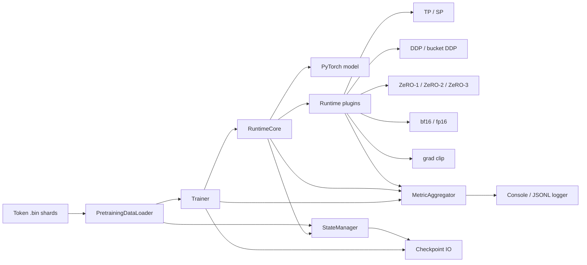
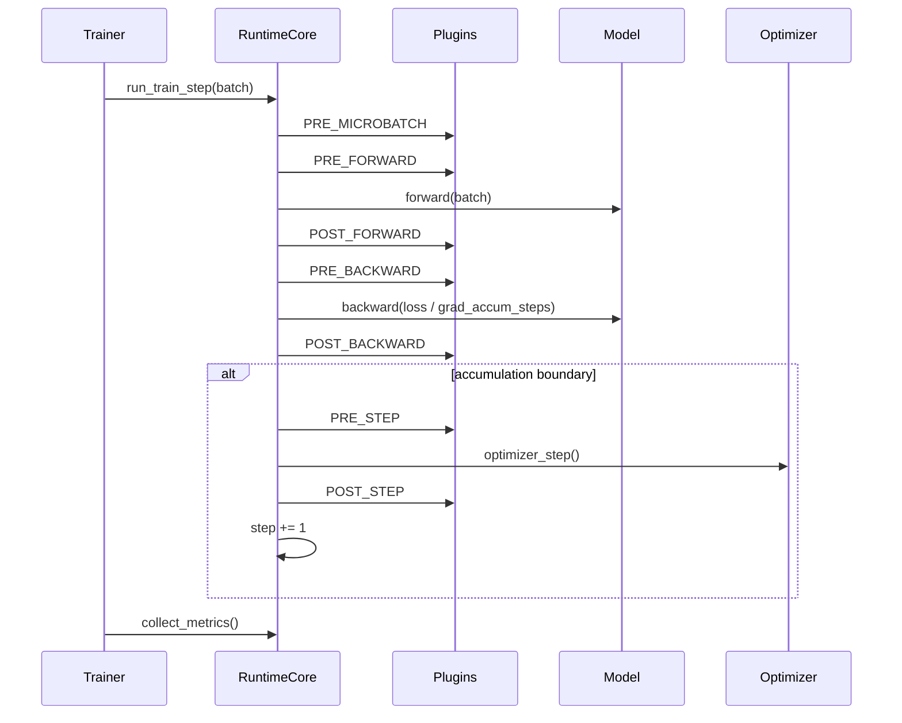

# LLM Train Systems

A compact pretraining runtime for experimenting with modern large-model training infrastructure.

The goal of this repo is not to hide PyTorch behind a framework. The goal is to make the moving pieces of a pretraining system explicit: process meshes, runtime phases, composable parallel plugins, sharded checkpointing, dataloader state, metric aggregation, and a trainer loop that can run real token shards.

## What Works

- Runtime plugin system with dependency ordering and phase hooks.
- Data parallel plugins: sync DDP, async DDP, and bucketed DDP.
- Tensor parallel and sequence parallel layers for the tiny transformer path.
- ZeRO-1, ZeRO-2, and ZeRO-3 style optimizer/parameter sharding.
- Mixed precision hooks for bf16/fp16, with GradScaler state checkpointing for fp16.
- Gradient accumulation and gradient clipping.
- Stateful pretraining dataloader over mmap token shards.
- Sharded checkpoint save/load for model, optimizer, trainer, plugin, RNG, and dataloader state.
- Metric collection from runtime/plugins, interval aggregation, and console/jsonl logging.
- Console, JSONL, and W&B metric logging.
- End-to-end LLaMA/tiny pretraining recipe.

This is intentionally small enough to read, but the core control flow mirrors the shape of larger pretraining systems: Megatron-style TP/SP, ZeRO/FSDP-style optimizer ownership, explicit process mesh axes, and checkpoint metadata that describes local shards.

## System Flow



## Runtime Step

`RuntimeCore` runs one microbatch at a time. Plugins attach behavior around explicit phases:



The trainer collects metrics every microbatch, but only logs/checkpoints on optimizer-step boundaries. This keeps gradient accumulation metrics honest without making checkpoints land mid-step unless explicitly requested by tests.

## Batch Contract

The pretraining path passes dataloader batches directly through the trainer/runtime into the model:

```python
{
    "input_ids": Tensor[batch, seq],
    "labels": Tensor[batch, seq],
}
```

`TinyTransformer.forward()` also accepts `(input_ids, labels)` for tests and lower-level runtime checks. In both cases, labels are already aligned with logits; the model does not apply an extra causal shift. Test-only helpers that synthesize shifted labels live under `tests/`, not in the model package.

## Repository Layout

```text
data/       Stateful tensor and token-shard dataloaders
models/     TinyModel, TinyTransformer, and LLaMA variants with TP/SP specs
parallel/   ParallelPlan and TP/SP sharding specs
runtime/    RuntimeCore, ProcessMesh, plugin API, layers, plugins
state/      StateManager and sharded checkpoint IO
train/      Trainer loop
utils/      Logging and metric aggregation utilities
tools/      Dataset prep and pretraining entrypoints
tests/      Equivalence, checkpoint, integration, and resume tests
docs/       Architecture notes
```

## Quick Start

Install dependencies:

```bash
python -m venv .venv
. .venv/bin/activate
pip install -r requirements.txt
```

Run a tiny single-process pretraining smoke using committed token shards:

```bash
PYTHONPATH=. .venv/bin/python tools/pretrain.py \
  --model tiny \
  --data tests/testdata \
  --vocab-size 256 \
  --dim 32 \
  --n-heads 4 \
  --hidden-size 64 \
  --n-layers 1 \
  --seq-len 16 \
  --micro-batch-size 1 \
  --max-steps 2 \
  --log-every 1
```

Run the core smoke tests:

```bash
PYTHONPATH=. .venv/bin/python tests/smoke_runtime_core.py
PYTHONPATH=. .venv/bin/python tests/smoke_trainer_loop.py
```

Run a TP equivalence test:

```bash
PYTHONPATH=. .venv/bin/python tests/tiny_transformer_tp_runtime_core_equivalence.py \
  --world-size 2 \
  --tp-size 2
```

Run a heavier integration case:

```bash
PYTHONPATH=. .venv/bin/python tests/pretraining_loader_tp_sp_zero3_bf16_clip_accum2_resume.py \
  --world-size 4 \
  --dp-size 2 \
  --tp-size 2
```

That test exercises:

```text
PretrainingDataLoader + TP + SP + ZeRO-3 + bf16 + grad clip
+ gradient accumulation + checkpoint save/load + dataloader resume
```

## Preparing Token Shards

The runtime dataloader consumes raw `.bin` token shards. To tokenize a Hugging Face dataset:

```bash
PYTHONPATH=. .venv/bin/python tools/prepare_token_shards.py \
  --dataset HuggingFaceFW/fineweb-edu \
  --config sample-10BT \
  --split train \
  --column text \
  --tokenizer-name-or-path Qwen/Qwen2.5-7B \
  --output-dir datasets/fineweb_500m \
  --max-tokens 500000000 \
  --tokens-per-shard 100000000 \
  --streaming
```

Or use:

```bash
bash tools/data.sh
```

## Tiny Pretraining Recipe

Single-process LLaMA smoke:

```bash
PYTHONPATH=. .venv/bin/python tools/pretrain.py \
  --model llama \
  --data tests/testdata \
  --vocab-size 256 \
  --dim 32 \
  --n-heads 4 \
  --hidden-size 64 \
  --n-layers 1 \
  --seq-len 16 \
  --micro-batch-size 1 \
  --max-steps 20 \
  --metrics-jsonl logs/llama_smoke.jsonl
```

YAML recipes are supported for real runs:

```bash
PYTHONPATH=. .venv/bin/python tools/pretrain.py \
  --config configs/llama_10m.yaml \
  --data datasets/fineweb_10m \
  --dp-size 1 \
  --tp-size 1 \
  --no-use-sp \
  --zero-stage 0 \
  --max-steps 200 \
  --wandb-run-name llama-10m-single
```

Distributed example with TP/SP/ZeRO-3:

```bash
PYTHONPATH=. torchrun --nproc_per_node=4 tools/pretrain.py \
  --config configs/llama_50m.yaml \
  --data datasets/fineweb_50m
```

The script prints a resolved run summary on rank 0, including model size,
mesh, plugins, batch tokens, target tokens, logging, and checkpoint settings.

The training script logs `loss`, `lr`, `train/tokens`, `train/tokens_per_sec`, `perf/step_sec`, and CUDA memory metrics when CUDA is available. W&B is initialized only on rank 0. Fine-grained profiling is intentionally kept out of the steady-state training path.

## Checkpointing

Each checkpoint step is a directory:

```text
checkpoints/tiny/step_00000100/
  manifest.json
  model_rank_0.pt
  optim_rank_0.pt
  trainer_rank_0.pt
  ...
```

The manifest records rank-local model shards, optimizer source ranks, and artifact locations. `StateManager` owns export/import of model, optimizer, trainer, plugin, RNG, and dataloader state.

Resume:

```bash
PYTHONPATH=. .venv/bin/python tools/pretrain.py \
  --data datasets/fineweb_500m \
  --resume-from checkpoints/tiny/step_00000100 \
  --max-steps 200
```

## Design Notes

- The model stays close to normal PyTorch. Parallel behavior is declared by `parallelize_spec()` and applied by runtime plugins.
- `RuntimeCore` is the execution engine. It does not own the dataloader or logging sinks.
- `Trainer` owns the training loop, dataloader binding, checkpoint cadence, and metric cadence.
- Plugins can own optimizers, as ZeRO does. Otherwise `RuntimeCore` owns the optimizer.
- Metrics are produced locally by runtime/plugins, reduced over time by `MetricAggregator`, then optionally reduced across ranks.
- Checkpoint metadata is extensible: plugins can annotate parameter states and export plugin-specific state.

## Current Limitations

- Pipeline parallel, context parallel, and expert parallel are planned but not implemented yet.
- The tiny transformer is intentionally small and readable; it is not a production model implementation.
- YAML recipes cover the main experiment settings; CLI flags can override any recipe field for quick sweeps.
