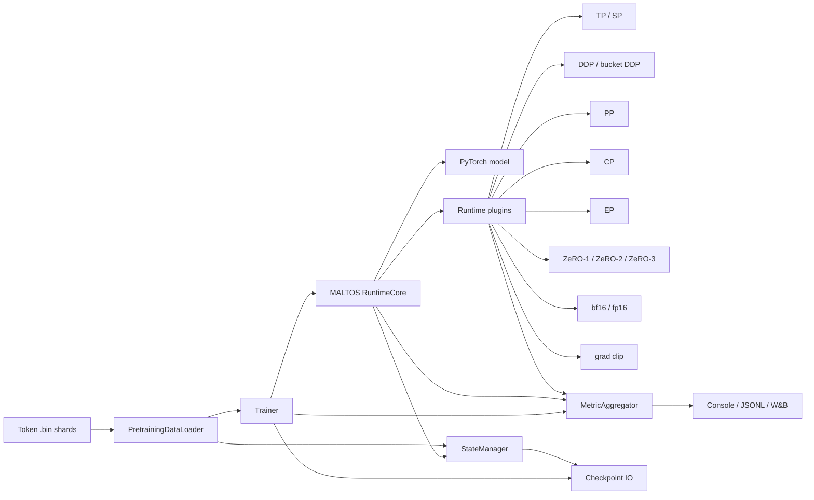
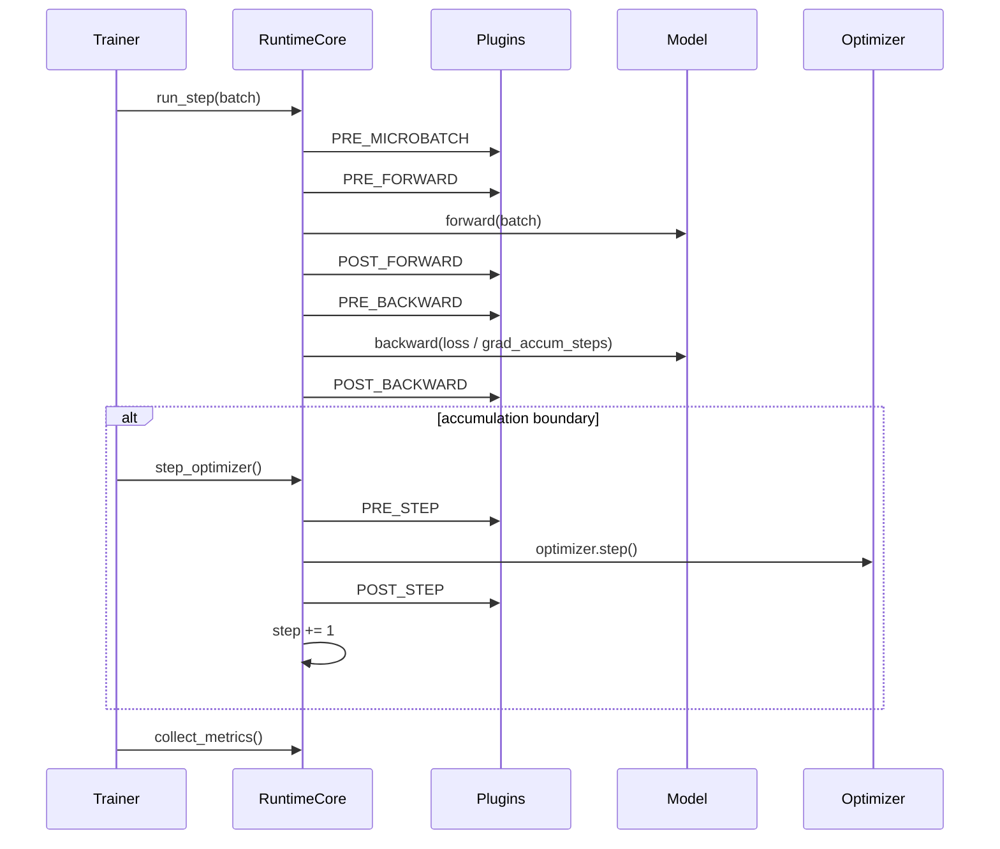

# MALTOS

**Modular Assembly LLM Training and Optimization Systems.**

MALTOS is a modular, composable runtime for large-scale foundation model
training. Tensor parallelism, sequence parallelism, data parallelism, ZeRO,
precision, checkpointing, metrics, and profiler traces are assembled as
plugins around one phase-oriented training runtime instead of being baked into
the trainer loop.

The goal of this repo is not to hide PyTorch behind a framework. The goal is to
make the moving pieces of a training system explicit: process meshes, runtime
phases, composable parallel plugins, sharded checkpointing, dataloader state,
metric aggregation, and a trainer loop that can run real token shards.

Technical writeups live in the companion blog repo:
[xing7code/maltos-blog](https://github.com/xing7code/maltos-blog).

Practical integration guide:
[docs/USER_GUIDE.md](docs/USER_GUIDE.md)

Experiment tracking: [W&B report](https://api.wandb.ai/links/xing7-org/f2s88x30)

## What Works

- Runtime plugin system with dependency ordering and phase hooks.
- Data parallel plugins: sync DDP, async DDP, and bucketed DDP.
- Tensor parallel and sequence parallel layers for tiny transformer and LLaMA paths.
- Pipeline parallel, context parallel, and expert parallel runtime paths exercised in tests.
- ZeRO-1, ZeRO-2, and ZeRO-3 style optimizer/parameter sharding.
- Mixed precision hooks for bf16/fp16, with GradScaler state checkpointing for fp16.
- Gradient accumulation and gradient clipping.
- PyTorch fused AdamW support for CUDA optimizer-step throughput.
- Stateful pretraining dataloader over mmap token shards.
- Sharded checkpoint save/load for model, optimizer, trainer, plugin, RNG, and dataloader state.
- Metric collection from runtime/plugins, interval aggregation, and console/jsonl/W&B logging.
- PyTorch profiler trace export for rank-local timeline debugging.
- YAML-driven pretraining CLI with dry-run, resume, checkpoint upload, and run manifest output.

This repo is intentionally small enough to read, but the core control flow
mirrors larger pretraining systems: Megatron-style TP/SP, ZeRO/FSDP-style
optimizer ownership, explicit process mesh axes, and checkpoint metadata that
describes local shards. Long term, MALTOS is meant to grow from pretraining
into a modular training stack for SFT, preference training, RL, and fast
research workflows.

## Validation Snapshot

- `bash tests/run_matrix.sh` passes on the maintained matrix.
- Core smokes pass:
  - `tests/smoke_runtime_core.py`
  - `tests/smoke_trainer_loop.py`
  - `tests/smoke_pretrain_cli.py`
- Distributed CI runs a smaller regression subset covering TP, PP, CP, and EP+ZeRO resume.
- Real runs have been exercised on Vast.ai at 1 GPU, 2 GPU, and 4 GPU scale.
- A 4x4090 50M-token run used `DP=2, TP=2, SP, ZeRO-3, bf16, grad clip` and reached:
  - final step around `3100`
  - final loss around `0.56`
  - global throughput around `4.2k tokens/sec`
  - reserved memory around `1.3 GB / GPU`

## Support Matrix

The table below separates runtime capability from what the current pretraining
CLI exposes directly.

| Area | Runtime / tests | `tools/pretrain.py` |
|---|---|---|
| Single-process training | Supported | Supported |
| Sync / async / bucketed DDP | Supported | Supported |
| Tensor parallelism | Supported | Supported |
| Sequence parallelism | Supported | Supported |
| Pipeline parallelism | Supported | Supported |
| Context parallelism | Supported | Supported |
| Expert parallelism | Supported | Not exposed yet |
| ZeRO-1 / ZeRO-2 / ZeRO-3 style sharding | Supported | Supported |
| BF16 / FP16 precision hooks | Supported | Supported |
| Gradient accumulation / clipping | Supported | Supported |
| Stateful token-shard dataloader | Supported | Supported |
| Sharded checkpoint save/load | Supported | Supported |
| W&B metric logging and checkpoint artifacts | Supported | Supported |
| LLaMA activation checkpointing | Supported | Supported |
| LLaMA SDPA attention backends | Supported | Supported |
| FlashAttention-specific custom kernels | Not implemented | Not implemented |

## MALTOS Runtime Flow



## Runtime Step

`Trainer` owns optimizer-step cadence. `RuntimeCore.run_step()` executes one
logical training microstep: forward, backward, plugin phases, and gradient
accumulation scaling. It returns `(loss, should_step)` so the trainer can
decide whether to call `RuntimeCore.step_optimizer()` at the accumulation
boundary.

```python
loss, should_step = runtime.run_step(batch)
if should_step:
    runtime.step_optimizer()
```

`StepContext` currently carries:

- `step`
- `microbatch_idx`
- `grad_accum_steps`
- `pp_cur_microbatch_idx`
- `pp_status`

The default runtime path is still a single forward/backward implementation, but
parallel strategies such as PP can override `build_step_runner()` and drive
their own microbatch schedule inside the same runtime contract.



The trainer collects metrics every microstep, but only logs and checkpoints on
optimizer-step boundaries. This keeps gradient accumulation observability honest
without making checkpoints land mid-step unless a test intentionally exercises
that path.

Current PP support is intentionally narrower than the rest of the runtime:
decoder-only TinyTransformer/LLaMA layer partitioning, runtime-owned optimizer
per stage, and pipeline microbatch scheduling inside `run_step()`. The
runtime/plugin boundaries support PP composed with TP/SP, CP, DDP, ZeRO, and in
the test matrix also EP, but more advanced PP/CP algorithms are still future
work.

## Batch Contract

The pretraining path passes dataloader batches directly through the
trainer/runtime into the model:

```python
{
    "input_ids": Tensor[batch, seq],
    "labels": Tensor[batch, seq],
}
```

`TinyTransformer.forward()` also accepts `(input_ids, labels)` for tests and
lower-level runtime checks. In both cases, labels are already aligned with
logits; the model does not apply an extra causal shift.

## Repository Layout

```text
data/       Stateful tensor and token-shard dataloaders
models/     TinyModel, TinyTransformer, TinyMoE, and LLaMA variants
parallel/   ParallelPlan, schedules, and parallel specs
runtime/    RuntimeCore, MeshConfig/group management, plugin API, plugins
state/      StateManager and sharded checkpoint IO
train/      Trainer loop
utils/      Logging, distributed helpers, and metric aggregation
tools/      Dataset prep, pretraining entrypoints, checkpoint upload helpers
tests/      Equivalence, checkpoint, integration, and resume tests
docs/       Architecture notes and experiment playbooks
```

## Quick Start

Install dependencies:

```bash
python -m venv .venv
. .venv/bin/activate
pip install -r requirements.txt
```

Run a tiny single-process pretraining smoke using committed token shards:

```bash
PYTHONPATH=. .venv/bin/python tools/pretrain.py \
  --model tiny \
  --data tests/testdata \
  --vocab-size 256 \
  --dim 32 \
  --n-heads 4 \
  --hidden-size 64 \
  --n-layers 1 \
  --seq-len 16 \
  --micro-batch-size 1 \
  --max-steps 2 \
  --log-every 1
```

Run the core smoke tests:

```bash
PYTHONPATH=. .venv/bin/python tests/smoke_runtime_core.py
PYTHONPATH=. .venv/bin/python tests/smoke_trainer_loop.py
PYTHONPATH=. .venv/bin/python tests/smoke_pretrain_cli.py
```

Run a TP equivalence test:

```bash
PYTHONPATH=. .venv/bin/python tests/tiny_transformer_tp_runtime_core_equivalence.py \
  --world-size 2 \
  --tp-size 2
```

Run a heavier integration case:

```bash
PYTHONPATH=. .venv/bin/python tests/pretraining_loader_tp_sp_zero3_bf16_clip_accum2_resume.py \
  --world-size 4 \
  --dp-size 2 \
  --tp-size 2
```

That case exercises:

```text
PretrainingDataLoader + TP + SP + ZeRO-3 + bf16 + grad clip
+ gradient accumulation + checkpoint save/load + dataloader resume
```

Run the broader maintained matrix:

```bash
PYTHONPATH=. PYTHON_BIN=.venv/bin/python bash tests/run_matrix.sh
```

## Preparing Token Shards

The runtime dataloader consumes raw `.bin` token shards. To tokenize a Hugging
Face dataset:

```bash
PYTHONPATH=. .venv/bin/python tools/prepare_token_shards.py \
  --dataset HuggingFaceFW/fineweb-edu \
  --config sample-10BT \
  --split train \
  --column text \
  --tokenizer-name-or-path NousResearch/Llama-2-7b-hf \
  --expected-vocab-size 32000 \
  --output-dir datasets/fineweb_500m \
  --max-tokens 500000000 \
  --tokens-per-shard 100000000 \
  --streaming
```

Or use:

```bash
bash tools/data.sh
```

## Pretraining CLI

Single-process LLaMA smoke:

```bash
PYTHONPATH=. .venv/bin/python tools/pretrain.py \
  --model llama \
  --data tests/testdata \
  --vocab-size 256 \
  --dim 32 \
  --n-heads 4 \
  --hidden-size 64 \
  --n-layers 1 \
  --seq-len 16 \
  --micro-batch-size 1 \
  --max-steps 20 \
  --metrics-jsonl logs/llama_smoke.jsonl
```

YAML recipes are supported for real runs:

```bash
PYTHONPATH=. .venv/bin/python tools/pretrain.py \
  --config configs/llama_10m.yaml \
  --data datasets/fineweb_10m \
  --dp-size 1 \
  --tp-size 1 \
  --no-use-sp \
  --zero-stage 0 \
  --max-steps 200 \
  --wandb-run-name llama-10m-single
```

Distributed example with TP/SP/ZeRO-3:

```bash
PYTHONPATH=. torchrun --nproc_per_node=4 tools/pretrain.py \
  --config configs/llama_50m.yaml \
  --data datasets/fineweb_50m
```

The script prints a resolved run summary on rank 0, including model size,
plugins, training settings, token targets, logging, profiler, and checkpoint
settings.

Use `--dry-run` to validate a recipe without entering the training loop or
initializing W&B:

```bash
PYTHONPATH=. torchrun --nproc_per_node=4 tools/pretrain.py \
  --config configs/llama_50m.yaml \
  --data datasets/fineweb_50m \
  --dry-run
```

Use `--run-manifest` to write a JSON record of the resolved run configuration,
CLI args, and git metadata. This works for both dry-runs and normal training
runs:

```bash
PYTHONPATH=. torchrun --nproc_per_node=4 tools/pretrain.py \
  --config configs/llama_50m.yaml \
  --data datasets/fineweb_50m \
  --dry-run \
  --run-manifest logs/llama_50m_manifest.json
```

The training script logs `loss`, `lr`, `train/tokens`, `train/tokens_per_sec`,
`perf/step_sec`, `perf/step_sec_window`, estimated `perf/tflops_per_gpu`, and
CUDA memory metrics when CUDA is available. Timing metrics ending in `_sec` are
reported as per-optimizer-step averages over the logging interval; the matching
`*_sec_window` metric records the total wall time for that interval. Fine-grained
profiling is intentionally kept out of the steady-state training path. MFU is a
reporting-layer concern and can be computed offline from `perf/tflops_per_gpu`
and a declared hardware peak.

Use PyTorch profiler for trace-based performance debugging:

```bash
PYTHONPATH=. torchrun --nproc_per_node=4 tools/pretrain.py \
  --config configs/llama_50m.yaml \
  --data datasets/fineweb_50m \
  --max-steps 20 \
  --torch-profiler \
  --torch-profiler-dir traces/llama_50m \
  --torch-profiler-wait 2 \
  --torch-profiler-warmup 2 \
  --torch-profiler-active 4
```

Profiler traces are written per rank under `rank_XXXXX/` directories. This mode
is for CUDA/NCCL/operator timeline analysis and has non-trivial overhead; keep
it off for normal throughput runs.

Training recipes support AdamW hyperparameters plus constant, linear, and cosine
LR schedules:

```yaml
training:
  lr: 3.0e-4
  weight_decay: 0.1
  adam_beta1: 0.9
  adam_beta2: 0.95
  adam_eps: 1.0e-8
  fused_adamw: true
  lr_schedule: cosine
  warmup_steps: 100
  min_lr: 3.0e-5
```

The LLaMA path supports block-level activation checkpointing:

```bash
PYTHONPATH=. .venv/bin/python tools/pretrain.py \
  --config configs/llama_50m.yaml \
  --attention-backend sdpa_auto \
  --activation-checkpointing \
  --activation-checkpoint-every-n-layers 2
```

To continue logging into an existing W&B run, pass its run id:

```bash
PYTHONPATH=. torchrun --nproc_per_node=4 tools/pretrain.py \
  --config configs/llama_50m.yaml \
  --data datasets/fineweb_50m \
  --resume-from checkpoints/llama_50m/step_00002500 \
  --wandb-run-id oxqveqbo
```

W&B checkpoint artifacts can be enabled by setting `--wandb-checkpoint-every N`.
`N` must be a multiple of `--checkpoint-every`; local checkpointing remains the
source of truth, and rank 0 uploads selected checkpoint directories
asynchronously as W&B Artifacts.

Existing checkpoints can also be uploaded manually:

```bash
PYTHONPATH=. .venv/bin/python tools/upload_wandb_checkpoint.py \
  --checkpoint-dir checkpoints/llama_50m_dp2_tp2_sp_zero3 \
  --steps 500 1000 1500 2000 2500 \
  --project maltos \
  --entity xing7-org \
  --artifact-prefix llama-50m-dp2-tp2-sp-zero3-main
```

## Checkpointing

Each checkpoint step is a directory:

```text
checkpoints/tiny/step_00000100/
  manifest.json
  model_rank_0.pt
  optim_rank_0.pt
  trainer_rank_0.pt
  ...
```

The manifest records rank-local model shards, optimizer source ranks, and
artifact locations. `StateManager` owns export/import of model, optimizer,
trainer, plugin, RNG, and dataloader state.

Checkpoint writes are atomic at the step-directory level: the runtime writes a
`step_XXXXXXXX.tmp` directory first and renames it only after all rank-local
artifacts and the manifest are complete. Recipes can also set retention and
free-space guardrails:

```yaml
checkpoint:
  every: 100
  keep_last: 1
  keep_every_n_steps: 500
  min_free_gb: 5
```

`min_free_gb` is fail-fast: if the checkpoint filesystem has less free space
than requested, training raises instead of writing a partial checkpoint.

Resume:

```bash
PYTHONPATH=. .venv/bin/python tools/pretrain.py \
  --data datasets/fineweb_500m \
  --resume-from checkpoints/tiny/step_00000100 \
  --max-steps 200
```

## Design Notes

- The model stays close to normal PyTorch. TP/SP/PP/CP/EP behavior is declared by model-side specs and applied by runtime plugins.
- `RuntimeCore` is the execution engine. It does not own the dataloader or logging sinks.
- `Trainer` owns the training loop, dataloader binding, checkpoint cadence, and metric cadence.
- Plugins can own optimizers, as ZeRO does. Otherwise `RuntimeCore` owns the optimizer.
- Runtime-owned optimizers are created after model transformation so plugins can shard, wrap, or replace the module first.
- Metrics are produced locally by runtime/plugins, reduced over time by `MetricAggregator`, then optionally reduced across ranks.
- Checkpoint metadata is extensible: plugins can annotate parameter states and export plugin-specific state.

## Current Boundaries

- The runtime supports PP/CP/EP, but the current pretraining CLI only exposes PP and CP. EP is exercised through tests, not recipe flags yet.
- PP support is currently focused on decoder-only TinyTransformer/LLaMA partitioning and the maintained schedules in the test matrix.
- CP is currently a v0 implementation with sequence-length divisibility requirements, and some gradient-sync logic is still coupled to the current ZeRO implementations.
- Activation checkpointing is implemented for the LLaMA path; tiny models keep the simpler eager path.
- The LLaMA path supports `eager`, `sdpa_auto`, and `sdpa_flash` attention backends through PyTorch SDPA dispatch. Custom FlashAttention kernels are not implemented yet.
- The current implementation prioritizes clarity and correctness over Megatron-level throughput optimization.
