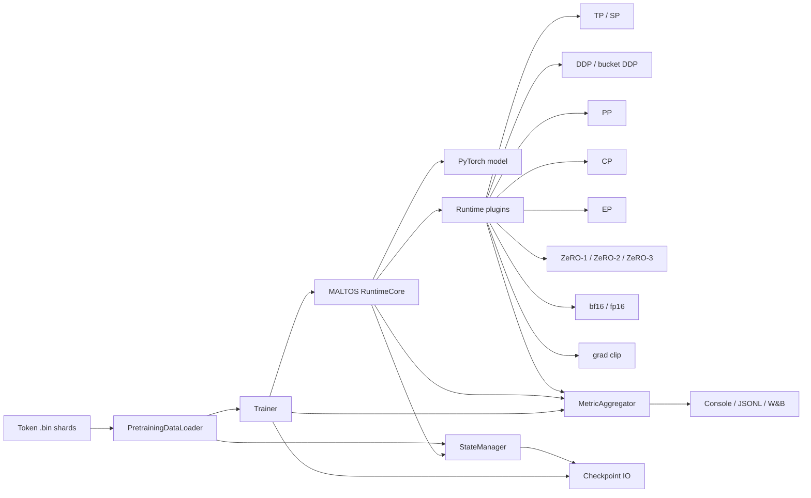

# MALTOS

**Modular Assembly LLM Training and Optimization Systems.**

A modular, plugin-based runtime for large-scale LLM pretraining — TP/SP/PP/CP/EP,
ZeRO-1/2/3, and sharded checkpointing composed around one explicit training loop.

The goal of this repo is not to hide PyTorch behind a framework. It's to make
the moving pieces of a training system explicit: process meshes, runtime
phases, composable parallel plugins, sharded checkpointing, dataloader state,
metric aggregation, and a trainer loop that can run real token shards.

## Highlights

- **Scaled to a real 13B model.** Extended the runtime to an OLMo2 (13.7B)
  SFT training run on 8×A100-SXM4-80GB, and diagnosed a chain of distributed-
  training correctness bugs that only surface at scale: an OLMo RoPE
  convention mismatch, ZeRO-3 × activation-checkpoint buffer-lifecycle
  conflicts, FP32 gradient-norm overflow, a Python closure late-binding bug
  in checkpointed layers, and an empty-target cross-entropy edge case. All
  fixes are covered by gradient-equivalence and full-stack regression tests.
- **1.36× throughput improvement**, measured under a controlled benchmark
  (fixed tokens/step, warmup + timed windows): 31.0 → 22.8 s/step,
  8,455 → 11,500 tok/s, via FlashAttention, a parallel-topology redesign
  (DP4/TP2/SP → DP8/TP1), microbatch/accumulation tuning, and profiler-
  guided metadata caching. A negative result (native TP/SP communication
  overlap: -0.86%) is documented rather than discarded — the goal is an
  honest optimization record, not a highlight reel.
- **Full parallelism composition from scratch.** TP, SP, PP (1F1B), CP
  (zigzag ring attention), EP (all2all MoE dispatch), and ZeRO-1/2/3, all
  assembled via a plugin registry with dependency resolution — minimal
  model-code changes, and optimizer construction deliberately deferred until
  after model transformation to avoid parameter-ownership bugs.
- **Correctness validated independently of throughput.** A full-stack
  numerical-equivalence and checkpoint/resume regression matrix across every
  parallelism combination (8×RTX 4090), plus real FineWeb-Edu pretraining
  runs confirming stable loss convergence.

Full experiment methodology, evidence tiers, and profiler traces:
[xing7code/maltos-blog](https://xing7code.github.io/maltos-blog)

## Support Matrix

| Area                                         | Runtime / tests | `tools/pretrain.py` |
| --------------------------------------------- | ---------------- | -------------------- |
| Single-process training                       | Supported         | Supported             |
| Sync / async / bucketed DDP                   | Supported         | Supported             |
| Tensor parallelism                            | Supported         | Supported             |
| Sequence parallelism                          | Supported         | Supported             |
| Pipeline parallelism                          | Supported         | Supported             |
| Context parallelism                           | Supported         | Supported             |
| Expert parallelism                            | Supported         | Supported             |
| ZeRO-1 / ZeRO-2 / ZeRO-3 style sharding       | Supported         | Supported             |
| BF16 / FP16 precision hooks                   | Supported         | Supported             |
| Gradient accumulation / clipping              | Supported         | Supported             |
| Stateful token-shard dataloader               | Supported         | Supported             |
| Sharded checkpoint save/load                  | Supported         | Supported             |
| W&B metric logging and checkpoint artifacts   | Supported         | Supported             |
| LLaMA activation checkpointing                | Supported         | Supported             |
| LLaMA SDPA attention backends                 | Supported         | Supported             |
| FlashAttention-specific custom kernels        | Supported         | Supported             |

## Validation Snapshot

- **13B-scale run** — OLMo2 SFT, 8×A100-SXM4-80GB, BF16 + FlashAttention +
  ZeRO-3 + full activation checkpoint, DP8/TP1, global batch 64
  (262,144 tokens/step): **22.795 s/step, 11,500 tok/s** — 1.36× vs. the
  controlled baseline. Full experiment ledger and profiler evidence in the
  companion blog.
- **4×RTX 4090, 50M-token run** — DP=2, TP=2, SP, ZeRO-3, bf16, grad clip:
  final step ~3,100, final loss ~0.56, ~4.2k tok/s, ~1.3 GB/GPU reserved.
- `bash tests/run_single_feature.sh` — maintained single-feature regression
  suite, passing.
- `bash tests/run_matrix.sh` — maintained full-stack parallelism matrix,
  passing.
- Core smokes pass: `smoke_runtime_core.py`, `smoke_trainer_loop.py`,
  `smoke_pretrain_cli.py`.
- Distributed CI runs a smaller regression subset covering TP, PP, CP, and
  EP+ZeRO resume.

## What Works

**Parallelism & scaling**
- Data parallel: sync DDP, async DDP, bucketed DDP
- Tensor parallel and sequence parallel (tiny transformer and LLaMA paths)
- Pipeline parallel, context parallel, expert parallel (exercised in tests)
- ZeRO-1, ZeRO-2, ZeRO-3 style optimizer/parameter sharding

**Precision & memory**
- Mixed precision hooks for bf16/fp16, with GradScaler state checkpointing
- Gradient accumulation and gradient clipping
- PyTorch fused AdamW for CUDA optimizer-step throughput

**Data & checkpointing**
- Stateful pretraining dataloader over mmap token shards
- Sharded checkpoint save/load for model, optimizer, trainer, plugin, RNG,
  and dataloader state

**Observability & tooling**
- Metric collection from runtime/plugins, interval aggregation,
  console/JSONL/W&B logging
- PyTorch profiler trace export for rank-local timeline debugging
- YAML-driven pretraining CLI with dry-run, resume, checkpoint upload, and
  run manifest output

This repo is intentionally small enough to read, but the core control flow
mirrors larger pretraining systems: Megatron-style TP/SP, ZeRO/FSDP-style
optimizer ownership, explicit process mesh axes, and checkpoint metadata
that describes local shards. Long term, MALTOS is meant to grow from
pretraining into a modular stack for SFT, preference training, RL, and fast
research workflows.

## Architecture


```mermaid
flowchart LR
    shards["Token .bin shards"] --> loader["PretrainingDataLoader"]
    loader --> trainer["Trainer"]

    trainer --> runtime["MALTOS RuntimeCore"]
    runtime --> model["PyTorch model"]
    runtime --> plugins["Runtime plugins"]
    runtime --> state["StateManager"]

    plugins --> tp["TP / SP"]
    plugins --> dp["DDP / bucket DDP"]
    plugins --> pp["PP"]
    plugins --> cp["CP"]
    plugins --> ep["EP"]
    plugins --> zero["ZeRO-1 / ZeRO-2 / ZeRO-3"]
    plugins --> precision["bf16 / fp16"]
    plugins --> clip["grad clip"]

    trainer --> metrics["MetricAggregator"]
    runtime --> metrics
    plugins --> metrics
    metrics --> logger["Console / JSONL / W&B"]

    trainer --> ckpt["Checkpoint IO"]
    state --> ckpt
    loader --> state
```

`Trainer` owns optimizer-step cadence; `RuntimeCore.run_step()` executes one
training microstep (forward, backward, plugin phases, grad-accum scaling)
and returns `(loss, should_step)` so the trainer can decide when to call
`RuntimeCore.step_optimizer()` at the accumulation boundary. Parallel
strategies such as PP override `build_step_runner()` and drive their own
microbatch schedule inside the same runtime contract.

Full runtime-step sequence diagram, batch contract, checkpoint format, design
notes, and current boundaries: [docs/ARCHITECTURE.md](docs/ARCHITECTURE.md)

## Repository Layout

```
data/       Stateful tensor and token-shard dataloaders
models/     TinyModel, TinyTransformer, TinyMoE, and LLaMA variants
parallel/   ParallelPlan, schedules, and parallel specs
runtime/    RuntimeCore, MeshConfig/group management, plugin API, plugins
state/      StateManager and sharded checkpoint IO
train/      Trainer loop
utils/      Logging, distributed helpers, and metric aggregation
tools/      Dataset prep, pretraining entrypoints, checkpoint upload helpers
tests/      Equivalence, checkpoint, integration, and resume tests
docs/       Architecture notes and experiment playbooks
```

## Quick Start

```bash
python -m venv .venv
. .venv/bin/activate
pip install -r requirements.txt
```

Run a tiny single-process pretraining smoke using committed token shards:

```bash
PYTHONPATH=. .venv/bin/python tools/pretrain.py \
  --model tiny \
  --data tests/testdata \
  --vocab-size 256 \
  --dim 32 \
  --n-heads 4 \
  --hidden-size 64 \
  --n-layers 1 \
  --seq-len 16 \
  --micro-batch-size 1 \
  --max-steps 2 \
  --log-every 1
```

Run the core smoke tests:

```bash
PYTHONPATH=. .venv/bin/python tests/smoke_runtime_core.py
PYTHONPATH=. .venv/bin/python tests/smoke_trainer_loop.py
PYTHONPATH=. .venv/bin/python tests/smoke_pretrain_cli.py
```

## Learn More

- **Practical integration guide** — [docs/USER_GUIDE.md](docs/USER_GUIDE.md)
- **Full CLI reference** (token-shard prep, YAML recipes, distributed launch,
  profiler, LR schedules, checkpoint upload/resume) —
  [docs/CLI_REFERENCE.md](docs/CLI_REFERENCE.md)
- **Architecture deep dive** (runtime-step sequence diagram, batch contract,
  checkpoint format, design notes, current boundaries) —
  [docs/ARCHITECTURE.md](docs/ARCHITECTURE.md)
- **Experiment tracking** — [W&B report](https://api.wandb.ai/links/xing7-org/f2s88x30)
- **Full OLMo2 13B debugging & optimization writeup** —
  [xing7code/maltos-blog](https://xing7code.github.io/maltos-blog)

## License

MIT
