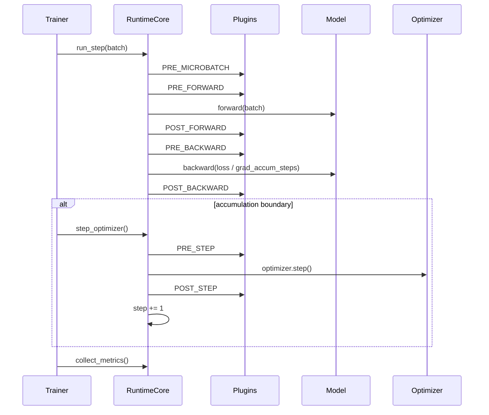

# Architecture

## Runtime Step

`Trainer` owns optimizer-step cadence. `RuntimeCore.run_step()` executes one
logical training microstep: forward, backward, plugin phases, and gradient
accumulation scaling. It returns `(loss, should_step)` so the trainer can
decide whether to call `RuntimeCore.step_optimizer()` at the accumulation
boundary.

```python
loss, should_step = runtime.run_step(batch)
if should_step:
    runtime.step_optimizer()
```

`StepContext` currently carries:

- `step`
- `microbatch_idx`
- `grad_accum_steps`
- `pp_cur_microbatch_idx`
- `pp_status`

The default runtime path is still a single forward/backward implementation,
but parallel strategies such as PP can override `build_step_runner()` and
drive their own microbatch schedule inside the same runtime contract.



The trainer collects metrics every microstep, but only logs and checkpoints
on optimizer-step boundaries. This keeps gradient-accumulation observability
honest without making checkpoints land mid-step unless a test intentionally
exercises that path.

Current PP support is intentionally narrower than the rest of the runtime:
decoder-only TinyTransformer/LLaMA layer partitioning, runtime-owned
optimizer per stage, and pipeline microbatch scheduling inside `run_step()`.
The runtime/plugin boundaries support PP composed with TP/SP, CP, DDP, ZeRO,
and — in the test matrix — EP, but more advanced PP/CP algorithms are still
future work.

## Batch Contract

The pretraining path passes dataloader batches directly through the
trainer/runtime into the model:

```python
{
    "input_ids": Tensor[batch, seq],
    "labels": Tensor[batch, seq],
}
```

`TinyTransformer.forward()` also accepts `(input_ids, labels)` for tests and
lower-level runtime checks. In both cases, labels are already aligned with
logits; the model does not apply an extra causal shift.

## Checkpointing

Each checkpoint step is a directory:

```
checkpoints/tiny/step_00000100/
  manifest.json
  model_rank_0.pt
  optim_rank_0.pt
  trainer_rank_0.pt
  ...
```

The manifest records rank-local model shards, optimizer source ranks, and
artifact locations. `StateManager` owns export/import of model, optimizer,
trainer, plugin, RNG, and dataloader state.

Checkpoint writes are atomic at the step-directory level: the runtime writes
a `step_XXXXXXXX.tmp` directory first and renames it only after all
rank-local artifacts and the manifest are complete. Recipes can also set
retention and free-space guardrails:

```yaml
checkpoint:
  every: 100
  keep_last: 1
  keep_every_n_steps: 500
  min_free_gb: 5
```

`min_free_gb` is fail-fast: if the checkpoint filesystem has less free space
than requested, training raises instead of writing a partial checkpoint.

Resume:

```bash
PYTHONPATH=. .venv/bin/python tools/pretrain.py \
  --data datasets/fineweb_500m \
  --resume-from checkpoints/tiny/step_00000100 \
  --max-steps 200
```

## Design Notes

- The model stays close to normal PyTorch. TP/SP/PP/CP/EP behavior is
  declared by model-side specs and applied by runtime plugins.
- `RuntimeCore` is the execution engine. It does not own the dataloader or
  logging sinks.
- `Trainer` owns the training loop, dataloader binding, checkpoint cadence,
  and metric cadence.
- Plugins can own optimizers, as ZeRO does. Otherwise `RuntimeCore` owns the
  optimizer.
- Runtime-owned optimizers are created after model transformation so
  plugins can shard, wrap, or replace the module first.
- Metrics are produced locally by runtime/plugins, reduced over time by
  `MetricAggregator`, then optionally reduced across ranks.
- Checkpoint metadata is extensible: plugins can annotate parameter states
  and export plugin-specific state.

## Current Boundaries

- The runtime supports PP/CP/EP, but the current pretraining CLI only
  exposes PP and CP. EP is exercised through tests, not recipe flags yet.
- PP support is currently focused on decoder-only TinyTransformer/LLaMA
  partitioning and the maintained schedules in the test matrix.
- CP is currently a v0 implementation with sequence-length divisibility
  requirements, and some gradient-sync logic is still coupled to the
  current ZeRO implementations.
- Activation checkpointing is implemented for the LLaMA path; tiny models
  keep the simpler eager path.
- The LLaMA path supports `eager`, `sdpa_auto`, and `sdpa_flash` attention
  backends through PyTorch SDPA dispatch. Custom FlashAttention kernels are
  not implemented yet.
- The current implementation prioritizes clarity and correctness over
  Megatron-level throughput optimization.
