# A Small but Realistic Runtime for LLM Pretraining

Modern LLM pretraining systems are often described through their parallelism
strategies: data parallelism, tensor parallelism, pipeline parallelism, ZeRO,
expert parallelism, context parallelism. But the deeper systems problem is not
any single strategy. It is how these strategies compose inside one training
runtime without turning the trainer into a pile of special cases.

I built this project to study that problem from first principles. The goal was
not to replace Megatron-LM, DeepSpeed, FSDP, or any production training stack.
The goal was to build something small enough to understand end to end, but
realistic enough to contain the same moving pieces that show up in large-scale
pretraining: process groups, model transformations, mixed precision, sharded
optimizer state, resumable data loading, distributed checkpoints, and runtime
metrics.

This post describes the design of that runtime and the first set of real
training experiments. The experiments are intentionally small. They are meant
to validate system behavior, not to train a useful language model.

repo: https://github.com/xing7code/llm-train-systems
>
> TODO: Add W&B report link once the 2-GPU and 4-GPU runs are complete.

## Design Goals

The project is organized around a few constraints that kept showing up during
implementation:

- **Composable parallelism.** A training loop should not need a separate branch
  for "TP plus SP plus ZeRO3" versus "bucketed DDP" versus "single GPU". Those
  are runtime behaviors, not trainer behaviors.

- **Explicit runtime phases.** Forward, backward, gradient reduction, optimizer
  stepping, checkpointing, and metric collection all need coordination points.
  If those coordination points are hidden inside a monolithic trainer, every new
  parallel strategy becomes invasive.

- **Checkpointing as a distributed protocol.** In a sharded training system, a
  parameter on rank 0 may only be a slice of a logical tensor. Saving
  `model.state_dict()` is not enough. The checkpoint needs to describe both the
  local shard and the global object it belongs to.

- **Training state beyond model state.** A real resume path needs the optimizer,
  scheduler, RNG, trainer step, and data cursor. Otherwise a run may restart
  without crashing but silently train on the wrong data or with the wrong
  optimizer state.

## System Overview

The runtime is organized around a small number of components. The trainer drives
policy; the runtime drives execution; plugins own distributed behavior; the
state manager owns checkpoint boundaries.

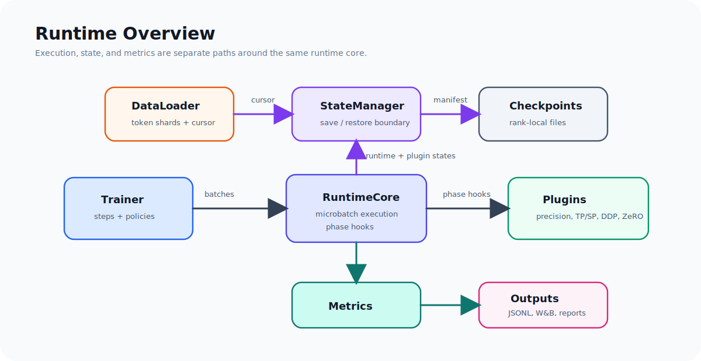

The trainer is deliberately boring. It decides how many steps to run, when to
log, and when to checkpoint. It does not know whether gradients are synchronized
by DDP, bucketed DDP, ZeRO2, or a future communication-overlap plugin.

`RuntimeCore` owns execution semantics. It knows how to run a microbatch, when
to call optimizer step, how to collect metrics, and how to drive plugin phases.
Plugins own distributed behavior.

`StateManager` binds together runtime state, trainer state, and dataloader
state. This split matters: the dataloader should not be owned by the runtime,
but checkpoint/resume needs both.

## Runtime Phases

The core abstraction is a sequence of runtime phases:

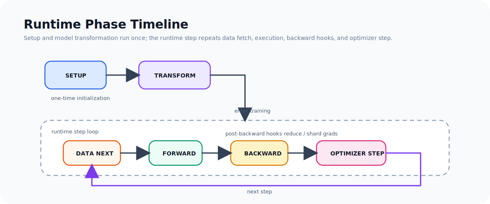

Each plugin can hook into the phases it cares about. For example:

- precision config wraps forward/backward with the desired compute dtype,
- gradient clipping runs before optimizer step,
- DDP and ZeRO plugins synchronize or shard gradients after backward,
- ZeRO3 materializes and releases parameter shards around module execution,
- performance metrics collect low-overhead step timing and memory counters.

This style keeps the trainer stable as the runtime grows. Adding a new
parallelism strategy should usually mean adding a plugin, not rewriting the
training loop.

The phase system is intentionally not a general-purpose event framework. It is
small and pretraining-specific. That constraint is useful: the goal is to expose
the coordination points that distributed training needs, not to create another
application framework.

## Plugin Dependencies

Plugins are not just a flat list of callbacks. Some plugins need to run before
or after others.

For example:

- precision setup should wrap execution before metrics inspect precision state,
- tensor-parallel model transformation should happen before optimizer
  construction,
- sequence parallelism depends on the tensor-parallel layout,
- gradient clipping should run after gradients are reduced/sharded into their
  final local form,
- checkpoint annotations from TP or ZeRO need to run after local checkpoint
  entries exist.

Each plugin declares a stable plugin id and optional dependency constraints. The
runtime resolves the plugin order with a small topological sort before executing
phase hooks.

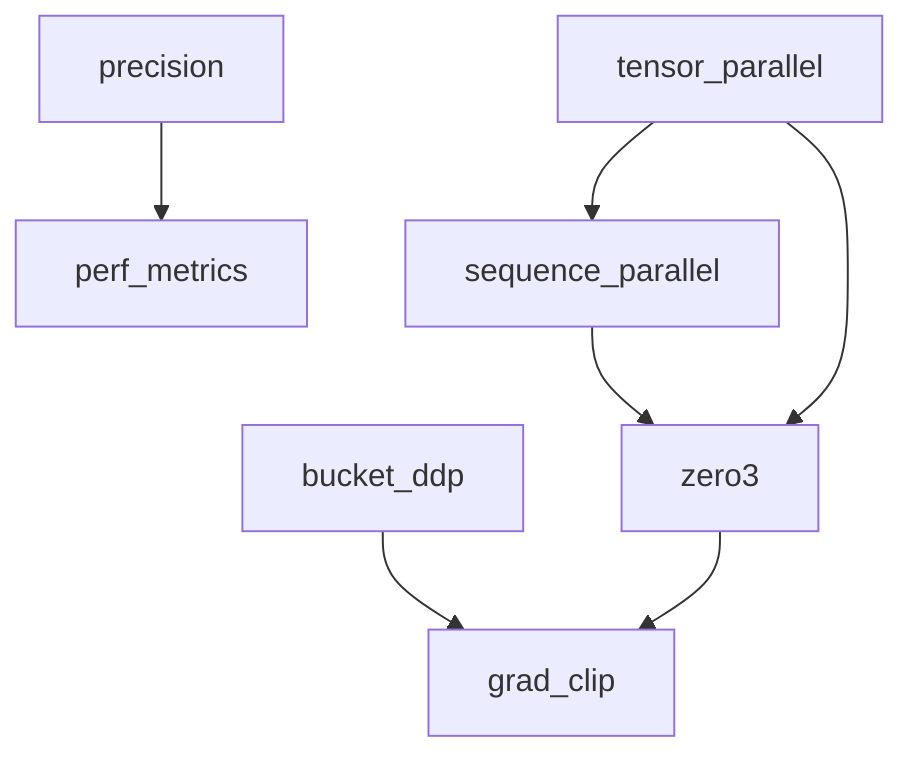

This is intentionally stricter than relying on construction order. It makes
plugin composition explicit and catches invalid runtime configurations early.

## Model and Optimizer Lifecycle

One subtle bug in distributed training systems is creating the optimizer too
early. Model transformation plugins may replace modules, shard parameters, or
wrap tensors. If the optimizer is constructed before those transformations, it
may hold references to the wrong parameters.

The runtime therefore supports an optimizer factory:

```text
construct model
  -> runtime setup
  -> plugin transform_model
  -> register final parameters
  -> build optimizer from factory
  -> validate optimizer ownership
  -> train
```

This also makes ownership explicit. In normal training, the runtime owns the
optimizer. In ZeRO-style training, a plugin may own optimizer state because it
needs to shard, save, or step it differently. The runtime validates that there
is at most one optimizer owner.

## Composable Parallelism

The current runtime supports several parallelism plugins:

| Strategy | Implementation role |
|---|---|
| Tensor Parallelism | Shards selected linear layers across a tensor-parallel group |
| Sequence Parallelism | Partitions sequence activations around TP regions |
| DDP | Provides synchronous and asynchronous gradient reduction |
| Bucketed DDP | Reduces gradients by buckets to enable overlap-style behavior |
| ZeRO1 | Shards optimizer state |
| ZeRO2 | Shards optimizer state and gradients |
| ZeRO3 | Shards optimizer state, gradients, and parameters |

The important part is not that each plugin is production complete. The important
part is that they compose through the same runtime interface. The same trainer
can run single-GPU training, TP+SP, DDP, or DP+TP+SP+ZeRO3.

Future plugins can follow the same pattern:

- pipeline parallelism,
- context parallelism,
- expert parallelism,
- activation checkpointing,
- fused optimizer paths,
- communication scheduling.

## Distributed Checkpointing

Checkpointing is where the runtime design becomes more than a clean training
loop.

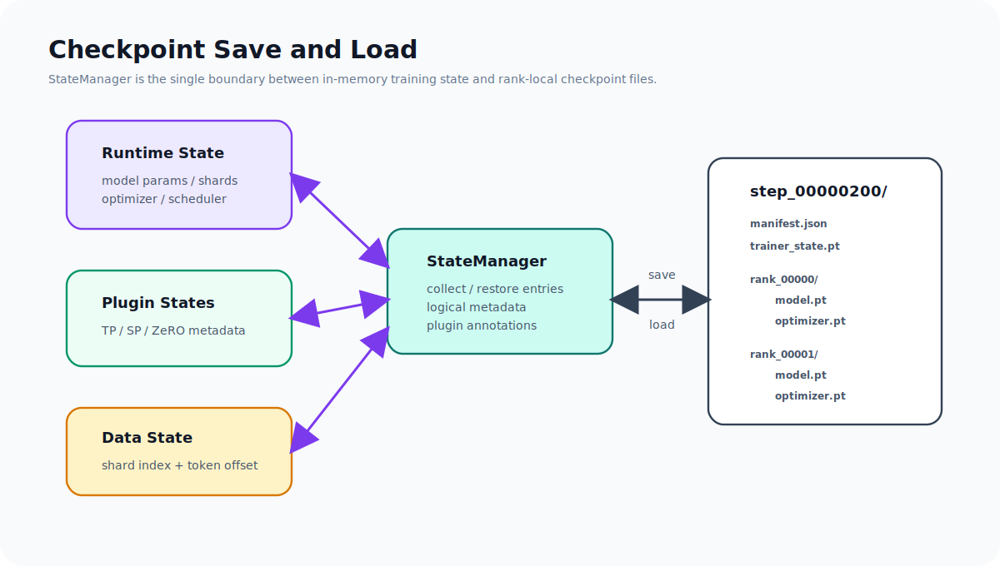

In a single-process PyTorch script, checkpointing is often just:

```python
torch.save(model.state_dict(), path)
```

That breaks down once the model is sharded. A rank-local tensor may be only one
slice of a global parameter. Optimizer state may be partitioned by data-parallel
rank. Some plugins need to annotate checkpoint entries with extra metadata so a
future restore can reconstruct the logical object.

This runtime represents checkpointed tensors as entries with fixed fields and
plugin annotations:

```text
CheckpointEntry
  name
  tensor
  logical_shape
  local_shape
  dtype
  owner
  annotations
```

The checkpoint layout is rank-local:

```text
step_00000200/
  manifest.json
  trainer_state.pt
  rank_00000/
    model.pt
    optimizer.pt
  rank_00001/
    model.pt
    optimizer.pt
```

The local layout keeps writes simple and scalable. The logical metadata makes
the checkpoint understandable after the fact.

Optimizer checkpointing follows the same principle. If a plugin owns the
optimizer, the plugin decides which ranks need to save optimizer shards. If the
runtime owns the optimizer, the runtime decides based on the parallel topology:
for example, DDP-only training does not need every data-parallel replica to save
identical optimizer state, while TP ranks may need to save different shards.

## Data Loading and Resume Correctness

Pretraining data loading is not a normal supervised-learning dataloader. The
training stream is a long token sequence, usually stored as token shards. Resume
correctness depends on knowing exactly where the next token should come from.

The project uses a `PretrainingDataLoader` that tracks:

- current shard,
- token offset inside the shard,
- sequence length,
- batch size.

The dataloader is intentionally decoupled from `RuntimeCore`. The runtime does
not need to know how data is stored. The `StateManager` binds them together for
checkpointing:

```text
save checkpoint:
  runtime state
  trainer state
  dataloader state

load checkpoint:
  restore runtime
  restore trainer counters
  restore dataloader cursor
```

This makes resume a first-class part of the system instead of an afterthought.

## Metrics

The runtime logs a small set of steady-state metrics:

- loss,
- learning rate,
- gradient norm,
- step time,
- tokens per second,
- TFLOPS per GPU,
- memory allocated/reserved,
- precision overflow state.

The metric path is runtime-aware. For example, token counts must not be
double-counted across tensor-parallel ranks. Runtime metrics are collected by
plugins and aggregated before logging to JSONL or W&B.

I intentionally avoided fine-grained CUDA event timing in the steady-state
training loop. Forward/backward/optimizer timing breakdowns are useful during
profiling, but they introduce synchronization points if measured naively. For
regular training, low-overhead step-level metrics are the better default.

## Experiments

The experiments use real tokenized data from FineWeb-Edu and a LLaMA-style model
with a LLaMA tokenizer. The first goal is to validate the full training path:

- real token shards,
- CUDA BF16 training,
- gradient accumulation,
- gradient clipping,
- checkpoint save/load,
- dataloader resume,
- W&B logging,
- W&B checkpoint artifacts.

The absolute performance numbers should not be interpreted as a Megatron or
DeepSpeed comparison. The model is intentionally small, and the implementation
does not yet use FlashAttention or fused kernels. The point of these runs is to
validate runtime semantics and expose scaling behavior.

### Experimental Setup

The setup is deliberately small, but it uses the same categories of state and
runtime behavior as a larger pretraining job.

| Component | Setup |
|---|---|
| Model | LLaMA-style decoder-only transformer |
| Tokenizer | LLaMA tokenizer |
| Data | FineWeb-Edu token shards |
| Precision | BF16 compute |
| Optimizer | AdamW |
| Logging | JSONL + W&B |
| Checkpointing | rank-local sharded checkpoints |

The single-GPU runs used two LLaMA-style model sizes:

| Config | Parameters | Layers | Hidden | Heads | MLP Hidden | Seq Len |
|---|---:|---:|---:|---:|---:|---:|
| small | 38.7M | 6 | 384 | 6 | 1,536 | 512 |
| bigger | 66.3M | 8 | 512 | 8 | 2,048 | 1024 |

TODO: Add public repo link and W&B Report link.

### Runs

| Run | Hardware | Topology | Data | Seq Len | Purpose |
|---|---:|---|---:|---:|---|
| single baseline | 1x4090 | no distributed parallelism | 10M | 512 | validate CUDA BF16 path |
| single bigger | 1x4090 | no distributed parallelism | 10M | 1024 | validate larger workload behavior |
| resume | 1x4090 | restore from step 200 | 10M | 512 | validate model/optimizer/data resume |
| TP/SP | 2xGPU | `tp=2, sp=true` | 10M | 1024 | validate model-parallel execution |
| bucketed DDP | 2xGPU | `dp=2, ddp=bucket` | 10M | 1024 | validate bucketed gradient reduction |
| ZeRO3 composed | 4xGPU | `dp=2, tp=2, sp=true, zero=3` | 10M/50M | 1024 | validate composed sharding |

TODO: Update hardware names after the final 2-GPU and 4-GPU runs.

### Results Summary

The single-GPU experiments were run on one RTX 4090 with CUDA BF16. They
validated the core pretraining path before moving to distributed runs:

- real FineWeb-Edu token shards,
- LLaMA tokenizer and 32k vocabulary,
- BF16 forward/backward,
- gradient accumulation,
- gradient clipping,
- rank-local checkpoint save/load,
- dataloader cursor restore,
- W&B metric logging.

Single 4090 summary:

| Config | Seq Len | Tokens / Step | Tokens / Sec | Step Time | TFLOPS / GPU | Reserved Memory |
|---|---:|---:|---:|---:|---:|---:|
| small | 512 | 2,048 | ~4.6k-4.8k | ~4.2s-4.6s | ~0.8 | ~1GB |
| bigger | 1024 | 4,096 | ~4.7k-5.0k | ~8.0s-8.7s | ~4.5-4.8 | ~4GB |

Small single-GPU run:


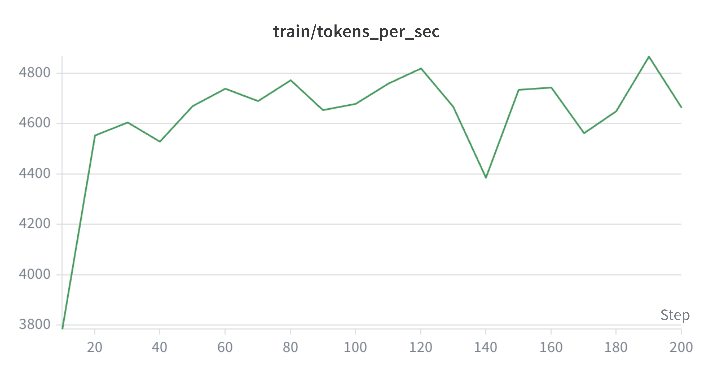

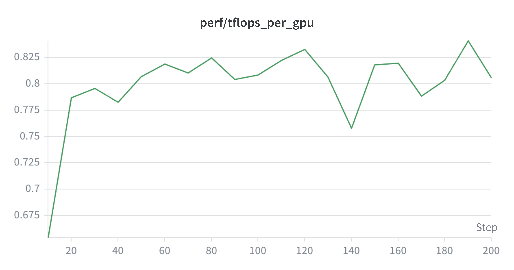


The small configuration has low absolute TFLOPS because the workload is too
small to saturate a 4090.

For the small single-GPU run, loss decreased from roughly 2.45 to 1.65 over 200
optimizer steps. Throughput warmed up quickly and then stayed around
4.6k-4.8k tokens/sec. Reserved memory stayed flat at about 1.06GB, which is a
useful sanity check that the training loop is not accumulating GPU memory across
steps. The reported TFLOPS/GPU stabilized around 0.8, matching the expected
under-utilization of such a small workload on a 4090.

Bigger single-GPU run:

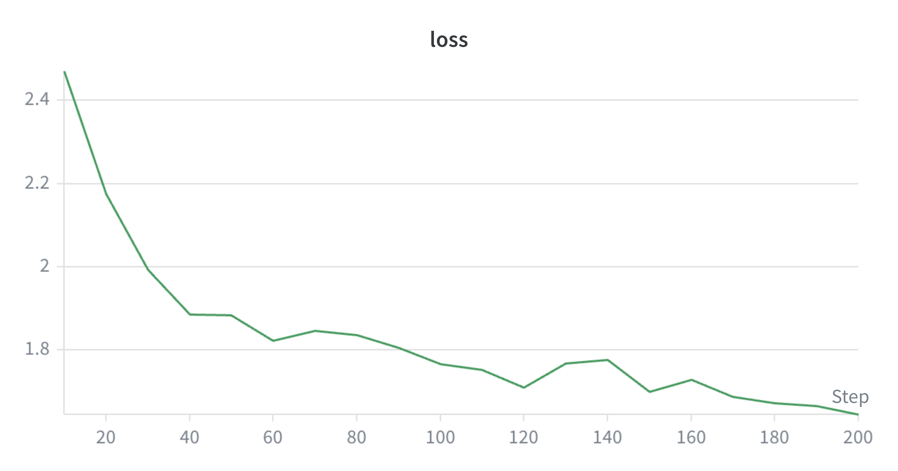


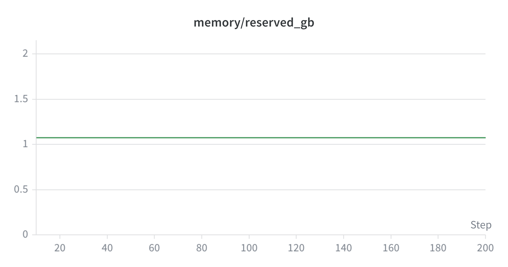

Increasing the sequence length and model size raises reported TFLOPS from
roughly 0.8 to 4.5-4.8 while keeping tokens/sec stable. This is the expected
direction: the runtime stays stable while the workload becomes more GPU-bound.

The resume smoke restored from a rank-local checkpoint at step 200 and continued
training. With `log_every=10`, the first printed resumed step was 210, as
expected. The first step after resume can be slightly slower due to load and
warmup effects, but steady-state throughput returned to the previous range.

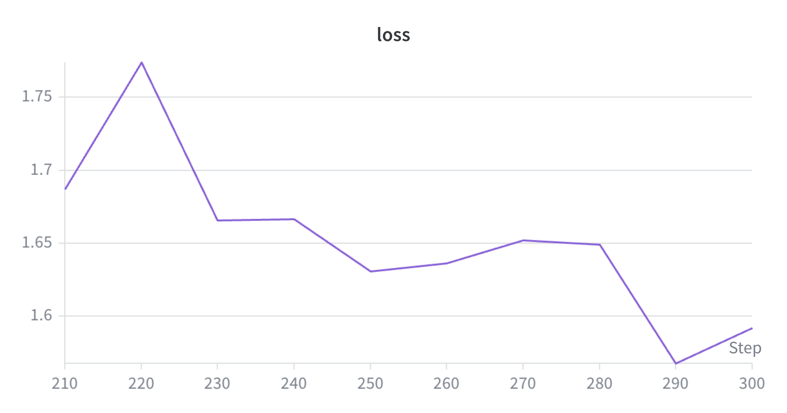

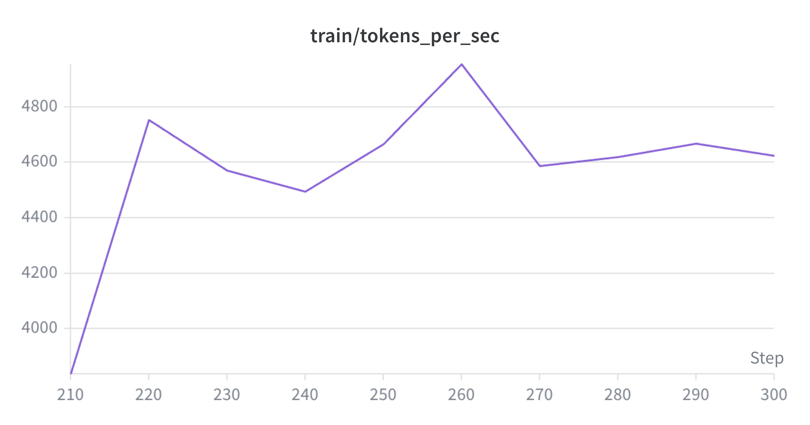

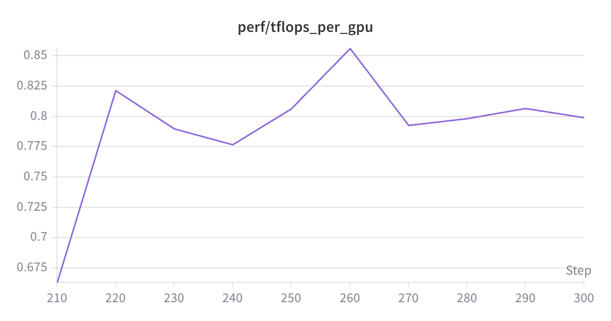

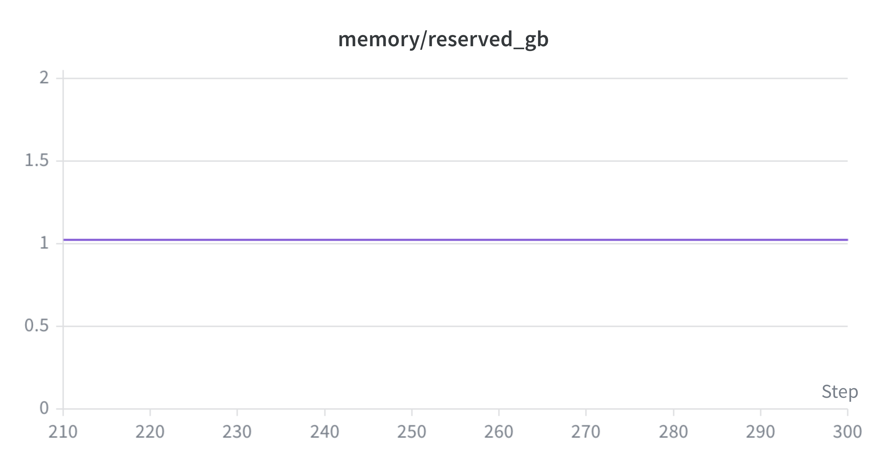

This validates that the checkpoint includes more than parameters: optimizer
state, trainer step, and dataloader cursor all need to resume together.

Single-GPU loss decreased normally in both configurations. The goal of these
runs was not model quality, but end-to-end runtime correctness: data loading,
CUDA execution, optimizer state, checkpointing, resume, and logging all worked
on real tokenized data.

### Distributed Results

TODO: Fill after 2-GPU and 4-GPU experiments.

| Run | Topology | Loss Trend | Tokens / Sec | Step Time | Memory | Checkpoint / Resume |
|---|---|---|---:|---:|---:|---|
| TP/SP | `tp=2, sp=true` | TODO | TODO | TODO | TODO | TODO |
| bucketed DDP | `dp=2, ddp=bucket` | TODO | TODO | TODO | TODO | TODO |
| ZeRO3 composed | `dp=2, tp=2, sp=true, zero=3` | TODO | TODO | TODO | TODO | TODO |

The most important distributed run is the 4-GPU ZeRO3 composition. It exercises
the parts of the system that are hardest to fake: process-group topology,
parameter sharding, optimizer ownership, distributed checkpointing, and resume.

## Lessons

**The trainer is the wrong place to encode distributed behavior.** Once a
training loop knows too much about DDP, TP, ZeRO, checkpointing, and metrics,
every new feature becomes a cross-cutting edit.

**Checkpointing defines the real boundaries of a training system.** It forces
the runtime to answer concrete questions: who owns this tensor, what is its
logical shape, which rank saves optimizer state, and what state must be restored
before the next batch is read?

**Small-scale experiments are still useful.** They do not prove large-scale
efficiency, but they catch real infrastructure bugs:

- optimizer creation before model transformation,
- double-counted token metrics under tensor parallelism,
- missing dataloader state on resume,
- incorrect optimizer checkpoint rank ownership,
- plugin interactions that only appear in composed configurations.

**Performance metrics need context.** A tiny model on a 4090 can report low
TFLOPS without indicating a broken runtime. The useful question is whether the
metric moves in the expected direction as the workload becomes larger and more
GPU-bound.

## What Comes Next

This post covered the system design and first training evidence. The next posts
will go deeper into individual subsystems:

1. Tensor and sequence parallelism: sharding linear layers and activations.
2. Bucketed DDP: why gradient reduction order matters.
3. ZeRO1, ZeRO2, and ZeRO3: what gets sharded at each stage.
4. Distributed checkpointing: logical tensors, local shards, and resume.
5. Performance work: FlashAttention, fused kernels, and profiling.
6. A 4-GPU mini pretraining run: TP/SP/ZeRO3 with real data and W&B artifacts.

The long-term goal is not just to build another training script. It is to build
a compact, inspectable runtime that makes modern pretraining infrastructure
easier to reason about.
